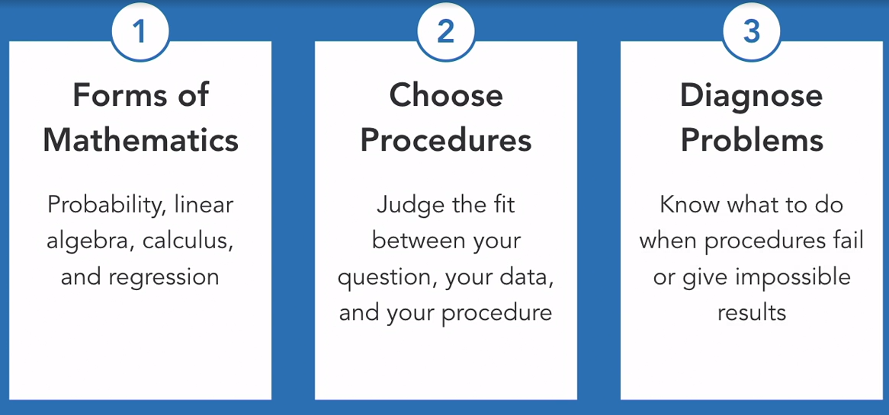
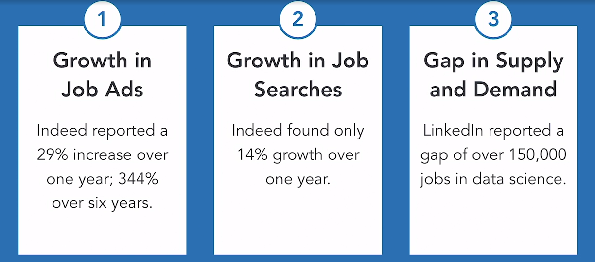

# What is Data Science?

## Data Science

In 2013, Drew Conway proposed the combination of hacking skills, that's computer programming, and math and statistics, and substantive or topical domain expertise, together give you data science, a new field that has revolutionized both the technology and the business world.

* Math and Stats
  * What?
* Substantive Expertise (Domain)
  * Why?
* Hacking Skills - Programming
  * How?

## Hacking Skills or Computer programming

 The reason that's important is because you have such novel 

1. Novel sources of data. 
2. Challenging formats
3. Streaming Data

Ability to work with

* Python and R
  * Programming languages for data manipulacion
* C, C++ and Java
  * Backend
* SQL
  * Data base
* TensorFlow
  * Open-source library used for deep learning

## Mathematics and Statistics

## Substantive Expertise

* Domain/ Business Knowledge

* Each domain has its own goals, methods, constrains

* What constitutes value?

* How to implement insights

  

   And finally, how to implement the insights because data science is an action-oriented field. It's designed to tell you what to do next to get the most value, provide the best service that you possibly can based on the data that you have. So taken together, the hacking or programming, the math and statistics, and the substantive expertise are the individual elements or components, the parts that make up the larger-than-the-sum whole of data science.

# Data Science demand

* It goes back to something that a Harvard Business Review had to say about it back in 2012. Thomas Davenport and D.J. Patil made the extraordinary claim that data science, of all things, was the sexiest job of the 21st century.
* But they had good reasons for saying this. They are argued that data scientists had one, a valuable combination of rare qualities that two, put them in high demand.

## Rare qualities

* They are able to **Find order, meaning, and value in unstructured data.** That's online sources, the graphs of social networks, audio, images, videos, and so on. 
* They're able to **predict outcomes** like who's likely to purchase something or who poses a security threat, or who's likely to develop a disease, or respond well to a new treatment. 
* They're able to **automate processes** like getting individualized recommendations while shopping, identifying friends in photographs, or giving psychological support in AI chat bots. And they're in high demand for a couple of really simple reasons.

## High demand

* Provides hidden insight
* Provides competitive advantage

* While demand for data scientists has increased dramatically, the availability has lagged, leading to a shortage of data scientists.

# References

* Linkedin - Data Science Foundations: Fundamentals

  * www.linkedin.com/learning/data-science-foundations-fundamentals-6

* How to Break into Data Science in 2021

  * https://www.youtube.com/watch?v=IHxnCzAWz0o

  
  
  